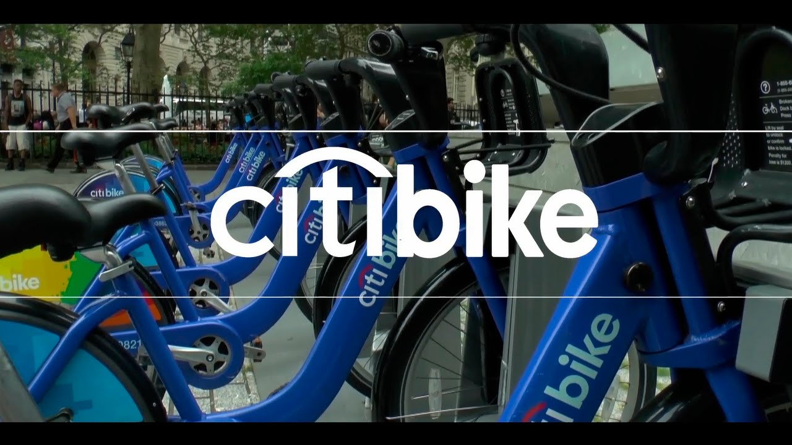
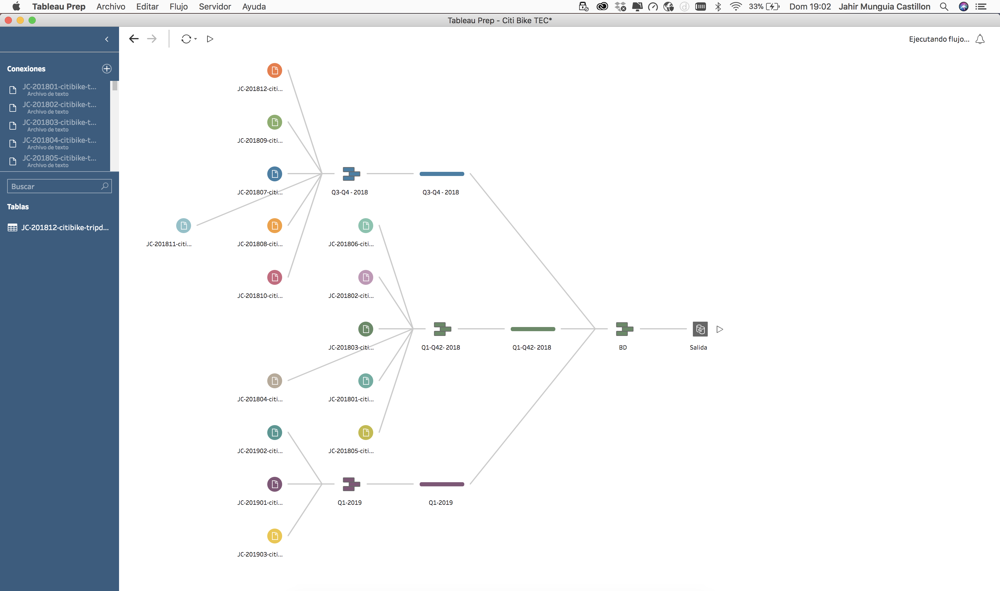
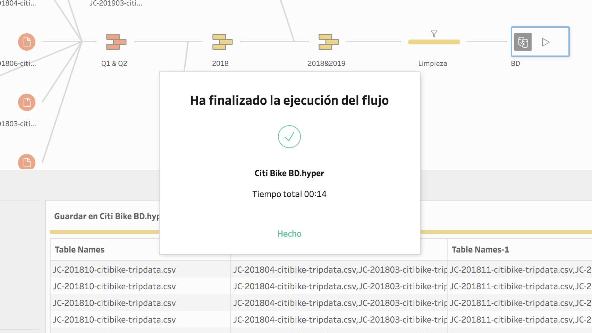
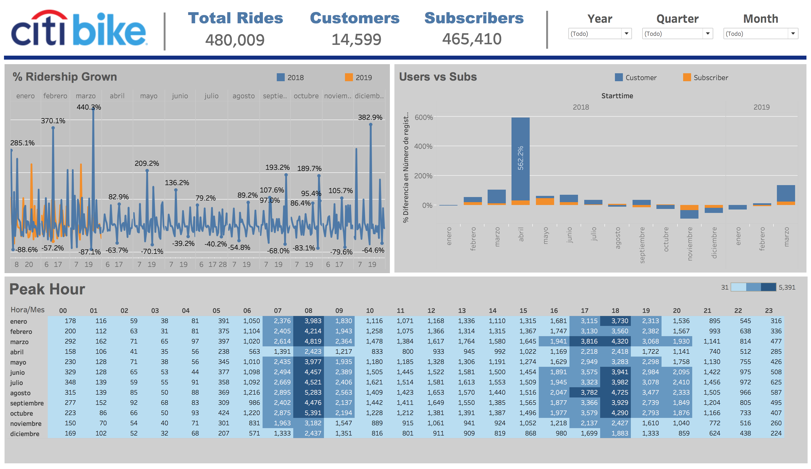
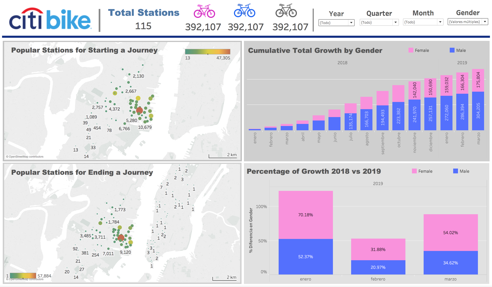
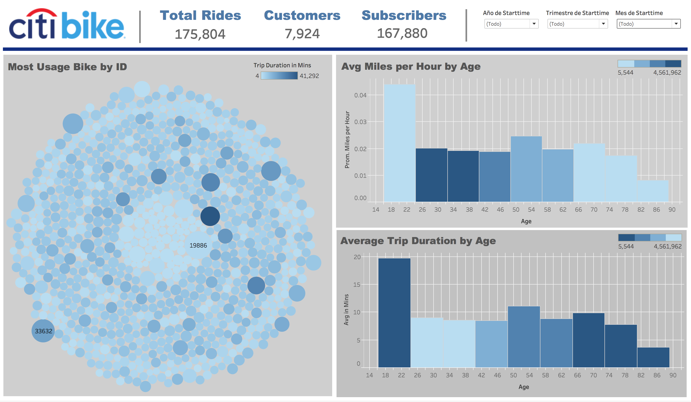

# Tableau Assignment - Citi Bike Analytics

**Jahir Munguia [LinkedIn](https://www.linkedin.com/in/jahirmunguia/) | [GitHub](https://github.com/HaShAkO)**

## Background

Congratulations on your new job! As the new lead analyst for the [New York Citi Bike](https://en.wikipedia.org/wiki/Citi_Bike) Program, you are now responsible for overseeing the largest bike sharing program in the United States. In your new role, you will be expected to generate regular reports for city officials looking to publicize and improve the city program.

Since 2013, the Citi Bike Program has implemented a robust infrastructure for collecting data on the program's utilization. Through the team's efforts, each month bike data is collected, organized, and made public on the [Citi Bike Data](https://www.citibikenyc.com/system-data) webpage.

However, while the data has been regularly updated, the team has yet to implement a dashboard or sophisticated reporting process. City officials have a number of questions on the program, so your first task on the job is to build a set of data reports to provide the answers. 

## Gathering Data and mergin them together in a Data Base.

I get directly from the [Citi Bike Data] the data for the Q1 of 2019 and the complete 2018, then i merge them and clean it useing Tableau Prep in order to have a Hyper file, which the perform of Tableau is quite faster than read a CSV file.

## Task

**Your task in this assignment is to aggregate the data found in the Citi Bike Trip History Logs to build a data dashboard, story, or report.  You may work with a timespan of your choosing. Optionally, you may merge multiple datasets from different periods. The following are some questions you may wish to tackle, especially if you are working with merged datasets. Do not limit yourself to these questions; they are suggestions for a starting point. Be creative!**

* How many trips have been recorded total during the chosen period? - **480,009**

* By what percentage has total ridership grown? - **For 2018 May 23 437% and for 2019 was Jan 22 the percentage was 242%**

* How has the proportion of short-term customers and annual subscribers changed? - **Customers is the 3% and Subscribers are 97% of the Total**

* What are the peak hours in which bikes are used during summer months? - **The two peaks are at 08:00 hrs with 5453 and 5005 users at 18:00 Hrs in Aug**

* What are the peak hours in which bikes are used during winter months? - **The two peaks are at 08:00 hrs with 4350 in Feb and 3805 users at 18:00 Hrs in Jan **

* Today, what are the top 10 stations in the city for starting a journey?
* Today, what are the top 10 stations in the city for ending a journey? 
* Today, what are the bottom 10 stations in the city for starting a journey?
* Today, what are the bottom 10 stations in the city for ending a journey?

**For this questions i think, a Map that can represent the usage by Station ID it will more usefull than a simply number**

* Today, what is the gender breakdown of active participants (Male v. Female)? - **Male represents the 78%, Female 22% of the active participants (Excluding the unknown)**
* How effective has gender outreach been in increasing female ridership over the timespan? - **Analizing the st Q of 2019 in comparison with the 2018, i dare to say that the increase of womans using this service has increasing more than mans altough male population are bigger than woman i mean, talking about the whole population of participants, in Jan the service increase in 70%, Feb 31%, March 54%, it will be interesting to find out which is the factor to this growth**

* How does the average trip duration change by age? - **The max avg abour trip duration occurs in the people that have actually between 16 and 23 Years, with a aprox 20 mins of trip duration in mins (For this i had to create a calculated field where i have to use the year of birth field of the information)** 

* What is the average distance in miles that a bike is ridden? - **The Histogram shows that have the same distribution than the previous question, the highest average are in the segment of 16 and 23 years with 0.04 miles per hour, (For this graph i also made a calculated field which in the Citi Bike Data Web Page mention that they calculated the mileage using an assumed speed of 7.456 miles per hour ** 

* Which bikes (by ID) are most likely due for repair or inspection in the timespan? **As long there are several data, if we select the whole dataset we can see that the ID's 19886 and 33632 are the mos likely bikes to repair**

* How variable is the utilization by bike ID? **As you can see in the Bubbles graph, the distribution of the usage of a bike are really uniform, so we can assume that the utilization is really variable among the time**

## Considerations

Remember, the people reading your analysis will NOT be data analysts. Your audience will be city officials, public administrators, and heads of New York City departments. Your data and analysis needs to be presented in a way that is focused, concise, easy-to-understand, and visually compelling. Your visualizations should be colorful enough to be included in press releases, and your analysis should be thoughtful enough for dictating programmatic changes. 

## Assessment

Your final product will be assessed on the following metrics: 

* Analytic Rigor

* Readability

* Visual Attraction

## Copyright

Data Boot Camp (C) 2018. All Rights Reserved.
